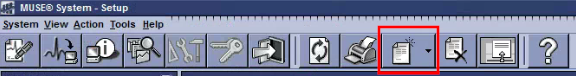
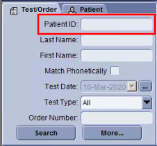
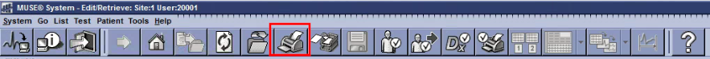
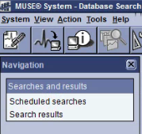
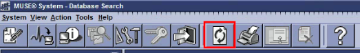

# Partners ECG
Extracting and tensorizing MUSE 12-lead ECGs

## Table of Contents
1. [Extracting ECGs to XML](#extracting-ecgs-to-xml)
2. [Automating ECG Extraction by MRN Search](#automating-ecg-extraction-by-mrn-search)
3. [Organizing XMLs and Removing Duplicates](#organizing-xmls-and-removing-duplicates)
4. [Tensorizing XMLs to HDF5](#tensorizing-xmls-to-hdf5)
5. [ECG Data Structure](#ecg-data-structure)
6. [Extracting ECG Metadata](#extracting-ecg-metadata)
7. [MUSE Virtual Machine Setup](#muse-virtual-machine-setup)

## Extracting ECGs to XML
### 1. Open the MUSE Editor
1. Connect to a Virtual Machine with MUSE using [chrome remote desktop](https://remotedesktop.google.com/access).
2. Log in to user account.
   1. MGH: `MuseAdmin` with password `Muse!Admin`.
   2. BWH: `musebkgnd` with password `Muse!Bkgnd`.
3. If your VM's trial of Windows is expired, see [MUSE Virtual Machine Setup](#muse-virtual-machine-setup).
4. Once logged in, go to the Desktop and open Services.
5. Select `MUSE` in the list that appears, click on "Start" in the left panel, and then close "Services".
6. Go to the Desktop and open "MUSE Editor".

### 2. Configure MUSE Editor
1. Open File Explorer and go to `C:\`. Create a new folder (Ctrl + Shift + N) and name it `export`.
2. Go to MUSE Editor and go to Device Setup: System -> Setup (Ctrl + Shift + P). The MUSE software will close and a new window will open.
3. Add a new folder by clicking the "New" icon in the top bar and selecting "Folder".  
  
Alternatively, from the top horizontal navigation bar: Action -> New -> Folder. A new window will appear called "Device Properties - Folder".
4. Fill in the "Device Name" field with the name `00export`. (`00` helps put the folder at the top of the print list).
5. Fill in the "Destination" field with the full path to the folder `C:\export`. Make sure you capitalize the `C`!
6. Enter `xml` for "File Extension" and select `XML` for "Output Type".  
7. Check all three boxes under "Output Options" including `Convert Statement Codes to Text`, `Include Measurement Matrix`, and `Include Waveforms`.
8. Click "OK".
9. Set up keyboard shortcuts. From the top menu bar -> Tools -> Options -> Shortcut Keys.
   1. Set "List > Select All Items" to `Ctrl + A`
   2. Set "Test > Print" to `Ctrl + P`

### 3. Search for ECGs in MUSE Editor
There are two ways of searching for ECGs: [by MRN](#a-search-by-mrnpatientid) or [by Date Range](#b-search-by-date-range)

#### a. Search by MRN/PatientID
1. Go to MUSE Editor and go to Edit/Retrieve: System -> Edit/Retrieve (Ctrl + Shift + E). The MUSE software will close and a new window will open.
2. Enter a MRN in the "Patient ID" field of the Test/Order box in the bottom left hand corner. Click "Search".  

3. A list of ECGs should populate in the box at the bottom of the screen. Highlight this entire list (click the first row, hold Shift, click the last row). 
4. Once the entire list is selected, click the "Print Test" button in the top menu bar.  
  
A new window will appear called "Select Device and Formatting Options".

#### b. Search by Date Range
1. Go to MUSE Editor and go to Database Search: System -> Database Search (Ctrl + Shift + D). The MUSE software will close and a new window will open.
2. In the left vertical navigation bar called "Searches and results", click on "Scheduled searches". Double-click any search to open "Template search setup".  
 
3. Change the "Report Title" to the date range of interest e.g. `2005-03` for the entire month of March 2005.
4. Under "Date Field", select `Acquisition Date`.  
5. Under "Scheduling", select `Run Once Now`.  
6. Select the appropriate date range (arrow keys move between month/day/year, tab moves between start and end dates).  
7. Click "Ok" (or "Apply" then "Close").
8. In the left vertical navigation bar called "Searches and results", click on "Search results".
9. Wait for the search result to show up. Refresh the view by clicking refresh in the top menu bar.  

10. Double click your search result. A new window will appear called "Search Results".
11. If there are `> 5000` records, check the box "Display full result set".
12. Click "Print all tests" and then "Yes". A new window will appear called "Select Device and Formatting Options".

### 4. Export ECGs from MUSE Editor
1. From "Select Device and Formatting Options", select the device you set up in section 2 as the output folder, it will probably be the first item in that list and already highlighted.
2. Set "Number of Copies" to `1`.
3. Set "Priority" to `Normal`
4. Set "Formatting" to `Use the default...`
5. Uncheck "Temporary Device"
6. Leave "Recipient Name" blank.
7. Click "OK". This should now export the ECG as XML to the folder from section 2.
8. If exporting `> 100` ECGs, MUSE Editor will likely freeze. This is normal.
9. Wait for ECGs to finish exporting. If the "Date modified" column in File Explorer for the folder shows the folder was last modified `> 1 hour` ago, the ECGs are likely done exporting.
10. Move the XML files to a data store, like MAD3 (`\\MAD3\MGH-NEURO-CDAC\Projects\partners_ecg\`) or a Partners DropBox (it is easier to download DropBox Desktop on the VM than to upload via the web browser to DropBox).

## Automating ECG Extraction by MRN Search
It is possible to automate the extraction of ECGs from MUSE Editor using [AutoHotKey](https://www.autohotkey.com/), a macro software. The macro can queue ECG extractions at a rate of 1000 MRNs/hour. This varies depending on the number of ECGs associated with each MRN. The actual time it takes for the ECGs to finish exporting to XML will be longer and is dependent on the total number of ECGs exported.

**To use the macro:**
1. [Download and install AutoHotKey](https://www.autohotkey.com/).
2. [Download the macro script](MUSE_search_mrn.ahk).
3. Edit and save the macro to use the path to the file with the list of MRNs to search for. The list must have only a single column of MRNs and the first MRN must be on the first line of the file.
4. Double click the macro file to start the macro.
5. Do step: [Configure MUSE Editor](#2-configure-muse-editor)
6. In MUSE Editor, go to the Edit/Retrieve screen (`Ctrl + Shift + E`). In the bottom left panel, set the ECG type (e.g. `Resting ECG`).
7. Start the macro with `Alt + J`.
8. The macro ends when it has searched for all the MRNs from the list.

Other uses:
1. If you edit and save the macro while it was already enabled, simply reload the changes with `Alt + R`.
2. If you need to abort the macro while it is running, use `Alt + Esc`. Note this does not necessarily mean the MUSE Editor stops exporting XMLs. To clear the print and format queue in MUSE Editor, use MUSE Status (`Ctrl + Shift + S`) to clear the queues.

**Notes:**
1. It is safe to disconnect and reconnect to the virtual machine using remote desktop while the macro is running. However, try to avoid key presses as they may introduce unknown behavior in MUSE Editor. If you need to exit the macro, use `Alt + Esc`.
2. If editing the script to use mouse movements, disable "Mouse Integration" for the virtual machine and the remote connection. "Mouse Integration" prevents the macro from controlling the mouse, however it does not disable mouse clicks.
3. The macro will finish queueing MRNs to be exported from MUSE before the XMLs are actually written to disk. This is because MUSE takes longer to format and write XMLs than it does for the macro to search for MRNs. Simply wait for the exports to finish before moving the extracted XMLs.
4. The macro may break on very large MRN lists when MUSE Editor crashes or the print queue fails for some reason. It is recommended to batch the MRN extraction.

## Organizing XMLs and Removing Duplicates
`1_organize_xml_into_yyyymm.py` moves XML files from a single directory into the appropriate yyyy-mm directory.

`2_remove_xml_duplicates.py` finds and removes exact duplicate XML files, as defined by every bit of two files being identical, determined via SHA-256 hashing. 

## Tensorizing XMLs to HDF5
`python 3_convert_xml_to_hd5.py` extracts data from all XML files and saves as [HDF5 files](https://www.hdfgroup.org). 

This script is called with the `-p` or `--parallel` argument to parallelize conversion across all available CPUs.  

One ECG from one XML is stored as one HDF5 file.  

**This will soon be updated so that all the ECGs for one patient are stored as one HDF5 file.**

## ECG Data Structure
Voltage is saved from XMLs as a dictionary of numpy arrays indexed by leads in the set `("I", "II", "V1", "V2", "V3", "V4", "V5", "V6")`, e.g.:

```
voltage = {'I': array([0, -4, -2, ..., 7]),
          {'II': array([2, -9, 0, ..., 5]),
          ...
          {'V6': array([1, -4, -3, ..., 4]),
```

Every other element extracted from the XML is returned as a string, even if the underlying primitive type is a number (e.g. age). Here are some of the more important elements:

```
acquisitiondate
atrialrate
dateofbirth
diagnosis_computer
diagnosis_md
ecgsamplebase
ecgsampleexponent
gender
heightin
location
locationname
overreaderfirstname
overreaderid
overreaderlastname
patientid
paxis
poffset
ponset
printerval
qoffset
qonset
qrscount
qrsduration
qtcfrederica
qtcorrected
qtinterval
race
raxis
taxis
toffset
ventricularrate
weightlbs
```

## Extracting ECG metadata

`4_extract_metadata_to_csv.py` iterates through every HDF5 file, identifies relevant data (e.g. MRN, diagnostic read, axes, intervals, age, gender, and race), and saves these data in a large CSV file:  

This CSV file will be used to construct a performant, queryable database to identify future cohorts for research projects.

**Metadata extraction will soon change along with new tensorization**

## MUSE Virtual Machine Setup
> Some of these steps will already be complete in the `.ova` image file from `mad3`.  
1. [Download and install VirtualBox](https://www.virtualbox.org/wiki/Downloads).
2. Open File Explorer, click on the navigation bar, type `\\MAD3\MGH-NEURO-CDAC\Projects\partners_ecg\`, and click enter.
3. Log in using your `mgh.harvard.edu` email address and MGH / Partners password.
4. Copy the virtual appliance `muse_mgh.ova` from this directory to your desktop. It will take 4-8 hours.
5. Open VirtualBox, click "Import" (yellow curved arrow icon at the top), select the `.ova` file, and click "next".
6. Modify the "base folder which will host all the virtual machines". You must select a place on your computer with at least 600 GB of storage. **The performance of MUSE Editor within the VM is disk bound, save the VM to a SSD if possible.**  
7. Click Import. It will take 1-2 hours.  
8. After the VM is imported, go back to the Oracle VM VirtualBox Manager home menu. Take a snapshot of the VM and name it `base`. If the VM is corrupted, no need to wait for the VM to reimport, simply restore the snapshot.
9. Configure the VM if desired. Also take a snapshot of the configured VM, name it `configured`. Possible configuration steps:
    1. Enable window resizing and clipboard: Attach an optical drive to the VM. Start the VM and insert "Guest Additions". Follow steps to install "Guest Additions". 
    2. Enable remote desktop: Start the VM and install chrome remote desktop or anydesk to the virtual machine. Use Google Chrome, it should be on the disk image.
10. If your trial of Windows is expired, try to reset by opening Command Prompt with Administrator Privileges in the virtual machine and enter: `slmgr /rearm`. This only works so many times, at that point, reset from snapshot or reimport from image.
