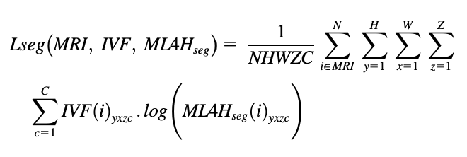

# [Deep learning to estimate cardiac magnetic resonance–derived left ventricular mass](https://www.sciencedirect.com/science/article/pii/S2666693621000232?ref=pdf_download&fr=RR-2&rr=80df2c704c374cd4)
Within participants of the UK Biobank prospective cohort undergoing CMR, 2 convolutional neural networks were trained to estimate LV mass. The first (ML4Hreg) performed regression informed by manually labeled LV mass (available in 5065 individuals), while the second (ML4Hseg) performed LV segmentation informed by InlineVF (version D13A) contours. All models were optimized using the Adam variant of stochastic gradient descent with initial learning rate 1 × 10-3, exponential learning rate decay, and batch size of 4 on K80 graphical processing units. 
# ML4Hreg
The first model is a 3D convolutional neural network regressor ML4Hreg trained with the manually annotated LV mass estimates provided by Petersen and colleagues to optimize the log cosh loss function, which behaves like L2 loss for small values and L1 loss for larger values: 
 

Here batch size, N, was 4 random samples from the training set of 3178 after excluding testing and validation samples from the total 5065 CMR images with LV mass values included in P.
# ML4Hseg
ML4Hseg, is a 3D semantic
segmenter. To facilitate model development in the absence of hand-labeled segmentations, we trained with the InlineVF contours to minimize Lseg; the per-pixel cross-entropy between the label and the model’s prediction. 

Here the batch size, N, was 4 from the total set of 33,071. Height, H, and width, W, are 256 voxels and there was a maximum of 13 Z slices along the short axis. There is a channel for each of the 3 labels, which were one-hot encoded in the training data, InlineVF (IVF), and probabilistic values from the softmax layer of ML4Hseg. Segmentation architectures used U-Net-style long-range connections between early convolutional layers and deeper layers. Since not all CMR images used the same pixel dimensions, models were built to incorporate pixel size values with their fully connected layers before making predictions. 
# Results
We compared the accuracy of both deep learning approaches to LV mass obtained using InlineVF within an independent holdout set using manually labeled LV mass as the gold standard.
 

Within 33,071 individuals who underwent CMR, we trained models to derive CMR-based LV mass using deep learning regression (ML4Hreg) and segmentation (ML4Hseg).

In an independent holdout set of 891 individuals with manually labeled LV mass estimates available, ML4Hseg had favorable correlation with manually labeled LV mass (r = 0.864, 95% confidence interval 0.847–0.880; MAE 10.41 g, 95% CI 9.82–10.99) as compared to ML4Hreg (r = 0.843, 95% confidence interval 0.823–0.861; MAE 10.51, 95% CI 9.86–11.15, P = .01) and centered InlineVF (r = 0.795, 95% confidence interval 0.770–0.818; MAE 14.30, 95% CI 13.46–11.01, P < .01)
