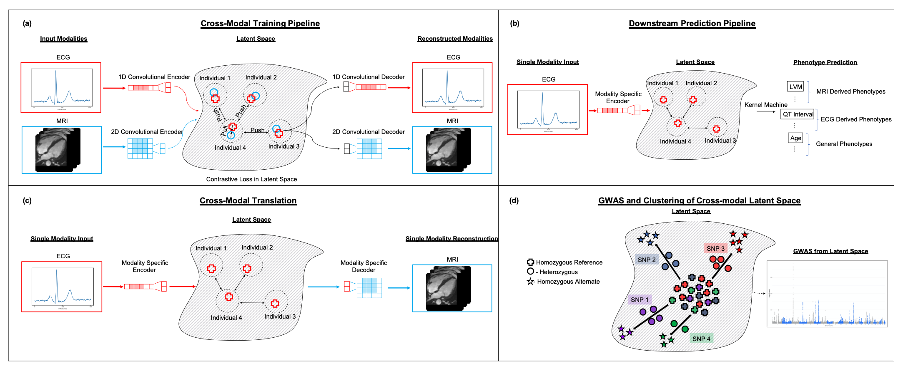

## A Cross-Modal Autoencoder Framework Learns Holistic Representations of Cardiovascular State
This directory contains code and instructions to create the models and results from [this paper](https://www.nature.com/articles/s41467-023-38125-0).

In the paper, using the heart as a model system, we develop a cross-modal autoencoder framework for integrating distinct data modalities and constructing a holistic representation of cardio-vascular state. 
In particular, we use our framework to construct such cross-modal representations from cardiac magnetic resonance images (MRIs), containing structural information, and electrocardiograms (ECGs), containing myoelectric information.



The model in the paper was trained on MRIs and ECGs available from the [UK Biobank](https://www.ukbiobank.ac.uk/).


### Software Versions:
```
Python 3.8.10
Numpy 1.22.4
Matplotlib 3.5.2
Tensorflow 2.9.1
ML4H 0.0.2
```

### Instructions:
To train the models we first build modality specific autoencoders for the ECGs and MRIs, then we pair them together with dropout and a contrastive loss.
The entry point in the code for every command line is in the [recipes.py](../../ml4h/recipes.py) file.
The following command lines assume tensorized ECGs and MRIs are avaible at $TENSORS and the ml4h repo has been cloned to the home directory to train the ECG-specific autoencoder

#### Train an ECG Autoencoder (with hypertuned parameters from the paper)
This model expects input (and output!) tensors of shape (batch_size, 600, 12) representing the 600 samples across 1.2 seconds from the 12 leads of the ECG.
```
${HOME}/ml4h/scripts/tf.sh ${HOME}/ml4h/ml4h/recipes.py \
  --mode train \
  --tensors ${TENSORS} \
  --input_tensors ecg.ecg_rest_median_raw_10 \
  --output_tensors ecg.ecg_rest_median_raw_10 \
  --tensormap_prefix ml4h.tensormap.ukb \
  --encoder_blocks conv_encode --decoder_blocks conv_decode \
  --activation mish --conv_layers 23 23 --dense_blocks 46 --block_size 5 \
  --dense_layers 256 --dense_normalize layer_norm \
  --batch_size 4 --epochs 696 --training_steps 128 --validation_steps 36 --test_steps 32 --patience 64 \
  --id hypertuned_ecg_median_raw_10_autoencoder_256d \
  --output_folder ${HOME}/results/ --inspect_model 
```

#### Train an MRI Autoencoder (with hypertuned parameters from the paper)
This model expects input (and output!) tensors of shape (batch_size, 96, 96, 50) representing the MRIs by cropping a 96 by 96 voxel window around the heart for all 50 time frames spanning a single cardiac cycle.
```
${HOME}/ml4h/scripts/tf.sh ${HOME}/ml4h/ml4h/recipes.py \
  --mode train \
  --tensors ${TENSORS} \
  --input_tensors mri.lax_4ch_heart_center \
  --output_tensors mri.lax_4ch_heart_center \
  --tensormap_prefix ml4h.tensormap.ukb \
  --encoder_blocks conv_encode --decoder_blocks conv_decode \
  --activation gelu --conv_layers 24 24 --dense_blocks 40 40 40 --block_size 3 \
  --dense_normalize layer_norm --pool_type average \
  --batch_size 4 --epochs 696 --training_steps 128 --validation_steps 36 --test_steps 32 --patience 64 \
  --id hypertuned_lax_4ch_heart_center_autoencoder_256d \
  --output_folder ${HOME}/results/ --inspect_model 
```

#### Train the Cross Modal Autoencoder with contrastive loss and modality dropout:
Having trained the two unimodal autoencoders above with encoders and decoders serialized to the output folder `${HOME}/results/` we can now train the cross modal autoencoder by pairing and finetuning the unimodal models.
```
${HOME}/ml4h/scripts/tf.sh ${HOME}/ml4h/ml4h/recipes.py \
  --mode train \
  --tensors ${TENSORS} \
  --input_tensors ecg.ecg_rest_median_raw_10 mri.lax_4ch_heart_center \
  --output_tensors ecg.ecg_rest_median_raw_10 mri.lax_4ch_heart_center \
  --encoder_blocks ${HOME}/results/hypertuned_ecg_median_raw_10_autoencoder_256d/encoder_ecg_rest_median_raw_10.h5 \
                   ${HOME}/results/hypertuned_lax_4ch_heart_center_autoencoder_256d/encoder_lax_4ch_heart_center.h5 \
  --decoder_blocks ${HOME}/results/hypertuned_ecg_median_raw_10_autoencoder_256d/decoder_ecg_rest_median_raw_10.h5 \
                   ${HOME}/results/hypertuned_lax_4ch_heart_center_autoencoder_256d/decoder_lax_4ch_heart_center.h5 \
  --merge_blocks pair --pairs ecg.ecg_rest_median_raw_10 mri.lax_4ch_heart_center \
  --pair_loss contrastive --pair_loss_weight 0.1 --pair_merge dropout \
  --batch_size 4 --epochs 696 --training_steps 128 --validation_steps 36 --test_steps 32 --patience 64 \
  --id dropfuse_256d \
  --output_folder ${HOME}/results/ --inspect_model 
```

#### Run inference with the cross modal autoencoder to generate latent spaces from both ECGs and MRIs
```
${HOME}/ml4h/scripts/tf.sh ${HOME}/ml4h/ml4h/recipes.py \
  --mode infer_encoders \
  --tensors ${TENSORS} \
  --input_tensors ecg.ecg_rest_median_raw_10 mri.lax_4ch_heart_center \
  --output_tensors ecg.ecg_rest_median_raw_10 mri.lax_4ch_heart_center \
  --id dropfuse_256d \
  --output_folder ${HOME}/results/ \
  --model_file ${HOME}/results/dropfuse_256d/dropfuse_256d.h5
```

