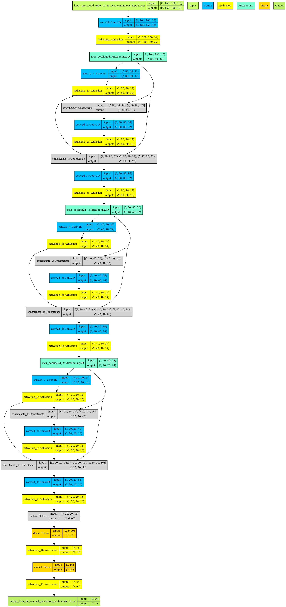

# Machine learning enables new insights into clinical significance of and genetic contributions to liver fat accumulation

Here we host two models for estimating liver fat from abdominal MRI. 
The liver fat percentage training data is from the returned liver fat values in the UK Biobank field ID 22402.

## Teacher Model
One model was trained with abdominal MRIs acquired using the echo protocol.  
This model takes input of shape 160 x 160 x 10 and emit a scalar representing estimated liver fat percentage.
The input TensorMap is defined at `tensormap.ukb.mri.gre_mullti_echo_10_te_liver`.
The output TensorMap associated with these values is defined at `tensormap.ukb.mri.liver_fat`.
This model is referred to as the teacher model.
The keras model file is at [liver_fat_from_echo.h5](liver_fat_from_echo.h5) and the model architecture is shown below:

## Student Model
The teacher model made inferences on all available MRIs acquired with the echo protocol.
The student model was trained using these inferences as truth data on abdominal MRIs acquired using the ideal protocol.  
This model takes input of shape 232 x 256 x 36 and emit a scalar representing estimated liver fat percentage.
The input TensorMap is defined at `tensormap.ukb.mri.lms_ideal_optimised_low_flip_6dyn`.
The output TensorMap associated with these values is defined at `tensormap.ukb.mri.liver_fat_echo_predicted`. 
The keras model file is at [liver_fat_from_ideal.h5](liver_fat_from_ideal.h5) and the model architecture is shown below:

