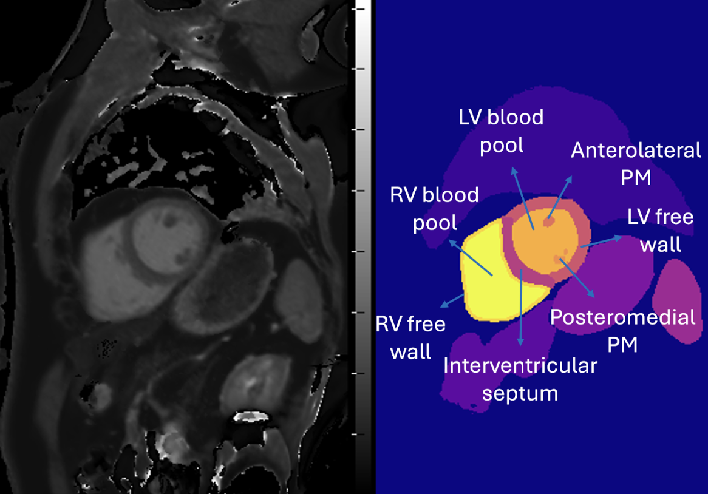
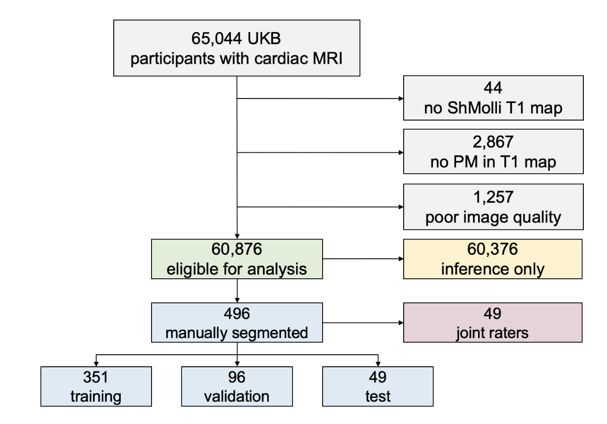
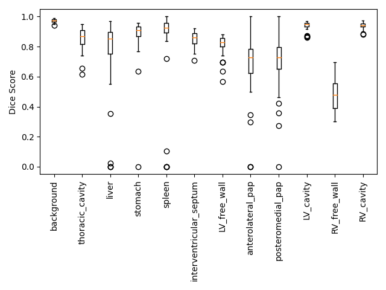
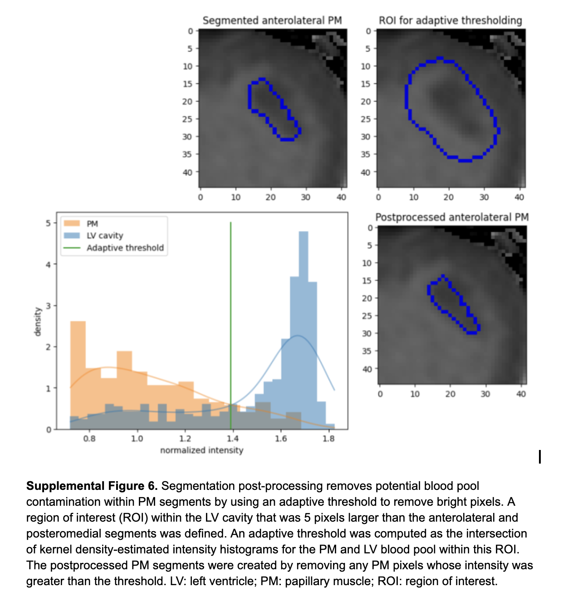
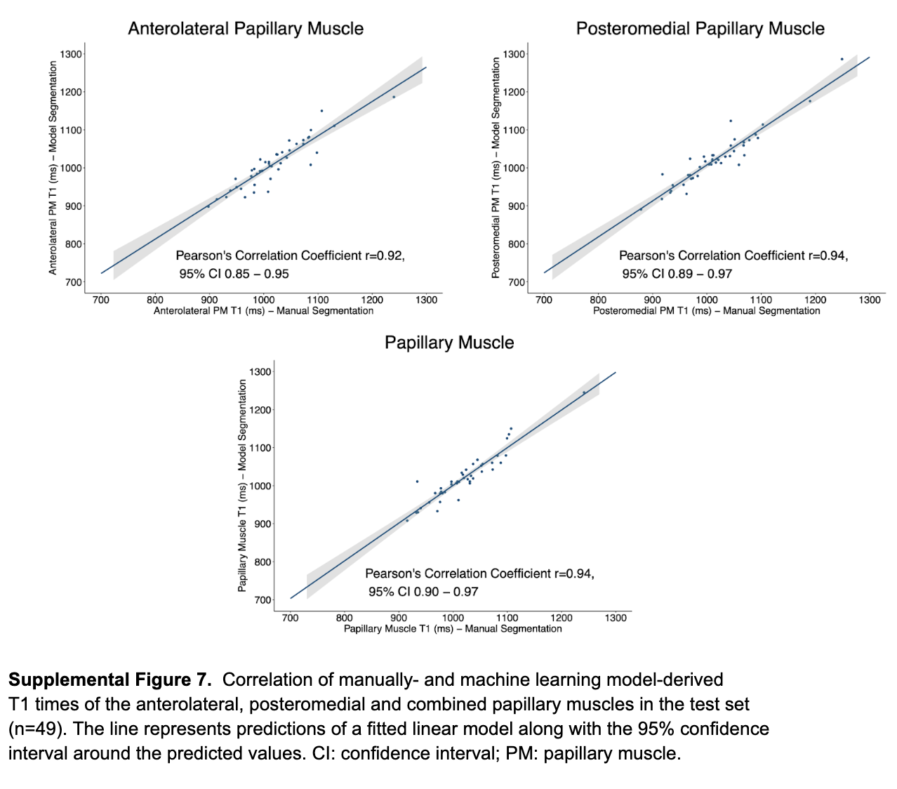

# Cardiac MRI T1 map segmentation and region statistics 

This image segmentation model has been trained to segment the following structures in mid-ventricular short-axis T1 maps:
- interventricular septum
- left ventricular blood pool
- right ventricular blood pool
- left ventricular free wall
- right ventricular free wall
- anterolateral papillary muscle
- posteromedial papillary muscle
- thoracic cavity
- liver
- stomach
- spleen

<div style="padding: 10px; background-color: white; display: inline-block;">
    
</div>

The model was trained and evaluated using the Shortened Modified Look-Locker Inversion Recovery (ShMOLLI) sequence images provided by UK Biobank. 

It is a U-Net–based convolutional neural network with dense blocks and skip connections. The model was trained for 200 epochs using the Rectified Adam optimizer and a soft Dice loss to address class imbalance, with an adaptive learning rate, early stopping, and data augmentation for improved generalization.

The raw model files are stored using git lfs so you must have it installed and localize the full ~175MB file with:

```
git lfs pull --include="model_zoo/t1_time_from_segmented_regions/batch8_lr0_0003_patience50.h5"
```

### Study design
<div style="padding: 10px; background-color: white; display: inline-block;">
    
</div>

### Dice scores compared to manual segmentations in 49 test images

The Dice coefficients achieved by the model for the papillary muscles were comparable to the inter-reader agreement observed between two board-certified cardiologists independently labeling the PMs. In other words, the level of concordance between the model and the reference standard approximated the degree of agreement achieved between expert human readers, indicating that model performance was within the range of expert-level variability. 

<div style="padding: 10px; background-color: white; display: inline-block;">
    
</div>

### Post-processing papillary muscle segments
<div style="padding: 10px; background-color: white; display: inline-block;">
    
</div>

### Agreement of papillary muscle median T1 times for manual vs model segmentations
<div style="padding: 10px; background-color: white; display: inline-block;">
    
</div>
