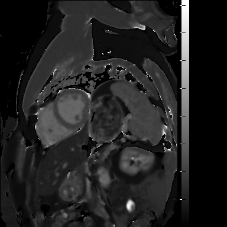
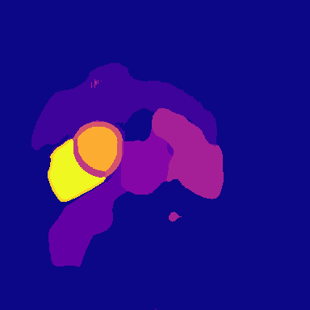
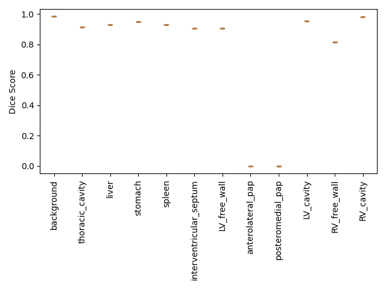

# Demo: T1 Time from Segmented Regions

This demo segments a cardiac T1 map (the example ShMOLLI image provided by UK Biobank) and extracts T1 time statistics (such as the median) within segmented regions. It has two parts:

1. **Inference with the pretrained model:** including segmenting the image and computing T1 time statistics per region.
2. **Training a model:** run a quick train/plot/compare cycle to show the training pipeline.

The full demo takes about 35-40 minutes to run. Most of this is to train a model, you can lower the number of epochs to reduce the time.

## Requirements

Run this demo on an **x86_64 Linux machine**.

> **Note:** The Docker image is x86_64. On Apple Silicon Macs, TensorFlow needs AVX instructions, which Docker Desktop's emulation doesn't provide, so the image won't run there. Use an x86_64 machine, or Colima/QEMU (not tested)

## Setup

### Create the directory structure

```
mkdir ~/demo
mkdir ~/demo/zip_folder
mkdir ~/demo/dicoms
mkdir ~/demo/csvs
mkdir ~/demo/outputs
mkdir ~/demo/outputs/model
mkdir ~/demo/outputs/plot_predictions
mkdir ~/demo/outputs/medians_inference
mkdir ~/demo/outputs/compare
```

### Download the example image

Download the public UK Biobank example of the experimental ShMOLLI sequence (DICOM format):

```
curl -sL -o ~/demo/zip_folder/1000001_20214_2_0.zip "https://biobank.ndph.ox.ac.uk/ukb/ukb/examples/20214_2_0.zip"
```

UK Biobank offers only one publicly downloadable example image, but the pipeline needs separate train, validation, and test samples. Copy the image under two more sample IDs:

```
cp ~/demo/zip_folder/1000001_20214_2_0.zip ~/demo/zip_folder/1000002_20214_2_0.zip
cp ~/demo/zip_folder/1000001_20214_2_0.zip ~/demo/zip_folder/1000003_20214_2_0.zip
```

### Define the data splits (one image each for train, validation and test)

```
cat > ~/demo/csvs/all.csv << 'EOF'
sample_id
1000001
1000002
1000003
EOF

cat > ~/demo/csvs/train.csv << 'EOF'
sample_id
1000001
EOF

cat > ~/demo/csvs/valid.csv << 'EOF'
sample_id
1000002
EOF

cat > ~/demo/csvs/test.csv << 'EOF'
sample_id
1000003
EOF
```

### Clone the ml4h repo and check out the correct branch for this project

```
cd ~
git clone https://github.com/broadinstitute/ml4h.git
cd ~/ml4h
git checkout --track origin/dfp_pap_gt_update_before_merge
```

### Download the pretrained segmentation model

The model weights are stored with Git LFS. If Git LFS isn't installed, install it first:

```
sudo apt-get install -y git-lfs 
git lfs install
```

Then pull the model file:

```
cd ~/ml4h
git lfs pull --include="model_zoo/t1_time_from_segmented_regions/*.h5"
```

### Tensorize the images

Convert the DICOMs to HDF5 tensors. The first run also pulls the Docker image, which can take about 5-10 minutes.

```
cd ~/ml4h
./scripts/tensorize.sh -t $HOME/demo/inputs/ -n 1 -a " --zip_folder $HOME/demo/zip_folder/ --mri_field_ids 20214 --xml_field_ids --dicoms $HOME/demo/dicoms/ "
```

## Part 1: Inference with the pretrained model

### Run inference to visualize the segmentation of the demo image

```
cd ~/ml4h
./scripts/tf.sh -c $HOME/ml4h/ml4h/recipes.py  --num_workers 1 --mode plot_predictions --tensors $HOME/demo/inputs/ --input_tensors mri.t1map_b2 --output_tensors mri.t1map_b2_segmentation --encoder_blocks conv_encode --decoder_blocks unet_conv_decode --u_connect mri.t1map_b2 mri.t1map_b2_segmentation --activation swish --batch_size 1 --epochs 200 --training_steps 1 --validation_steps 1 --test_steps 1 --patience 50 --learning_rate 0.0003 --tensormap_prefix ml4h.tensormap.ukb --inspect_model --sample_csv ~/demo/csvs/all.csv --train_csv ~/demo/csvs/train.csv --valid_csv ~/demo/csvs/valid.csv --test_csv ~/demo/csvs/test.csv --merge_blocks merge_conv_encode --conv_layers 32 32 32 --dense_blocks 64 128 256 --merge_dense_blocks 256 --decoder_dense_blocks 256 128 64 32 --merge_dimension 3 --dense_layers 0 --block_size 3 --skip_ground_truth --model_file $HOME/ml4h/model_zoo/t1_time_from_segmented_regions/batch8_lr0_0003_patience50.h5 --output_folder $HOME/demo/outputs/plot_predictions/ --id public_model_infer
```

The segmentation images are written to `~/demo/outputs/plot_predictions/public_model_infer/prediction_pngs`.

<table>
  <tr>
    <th align="center">Input T1 map</th>
    <th align="center">Predicted segmentation by pretrained model</th>
  </tr>
  <tr>
    <td align="center" bgcolor="white">
      
    </td>
    <td align="center" bgcolor="white">
      
    </td>
  </tr>
</table>

### Compute T1 statistics per region

The statistics step needs an MRI date for each sample, so create a file with placeholder dates:

```
sudo tee ~/demo/csvs/dates.csv > /dev/null << 'EOF'
sample_id,value
1000001,2026-01-01
1000002,2026-01-01
1000003,2026-01-01
EOF
```

Run inference and compute T1 statistics in each segmented region of interest. Regions of intererest are interventriclar septum, LV free wall, anterolateral papillary muscle, posteromedial papillary muscle, LV cavity, interventricular_septum and LV_free_wall (merged before postprocessing, indicated by +) and anterolateral papillary muscle and posteromedial papillary musscle (merged after postprocessing, indicated by ++):

```
cd ~/ml4h
./scripts/tf.sh -c $HOME/ml4h/ml4h/recipes.py --num_workers 1 --mode infer_stats_from_segmented_regions --tensors $HOME/demo/inputs/ --input_tensors mri.t1map_b2 --output_tensors mri.t1map_b2_segmentation --encoder_blocks conv_encode --decoder_blocks unet_conv_decode --u_connect mri.t1map_b2 mri.t1map_b2_segmentation --activation swish --batch_size 1 --epochs 200 --training_steps 1 --validation_steps 1 --test_steps 1  --patience 50 --learning_rate 0.0003 --tensormap_prefix ml4h.tensormap.ukb --sample_csv ~/demo/csvs/all.csv --train_csv ~/demo/csvs/train.csv --valid_csv ~/demo/csvs/valid.csv --test_csv ~/demo/csvs/test.csv --merge_blocks merge_conv_encode --conv_layers 32 32 32 --dense_blocks 64 128 256 --merge_dense_blocks 256 --decoder_dense_blocks 256 128 64 32 --merge_dimension 3 --dense_layers 0 --block_size 3 --app_csv $HOME/demo/csvs/dates.csv --structures_to_analyze interventricular_septum LV_free_wall anterolateral_pap posteromedial_pap LV_cavity interventricular_septum+LV_free_wall anterolateral_pap++posteromedial_pap --erosion_radius 1 1 0 0 1 1 --intensity_thresh_auto region_hist --intensity_thresh_in_structures anterolateral_pap posteromedial_pap --intensity_thresh_out_structure LV_cavity --intensity_thresh_auto_region_radius 5 --intensity_thresh_auto_clip_low 0.6580 --intensity_thresh_auto_clip_high 2.0181 --model_file $HOME/ml4h/model_zoo/t1_time_from_segmented_regions/batch8_lr0_0003_patience50.h5 --output_folder $HOME/demo/outputs/medians_inference/ --id public_model_infer
```

View the results:

```
cat ~/demo/outputs/medians_inference/public_model_infer/pred_public_model_infer_input_shmolli_192i_sax_b2s_sax_b2s_sax_b2s_t1map_continuous_output_shmolli_192i_sax_b2s_sax_b2s_sax_b2s_t1map_vnauffal_annotated_categorical.tsv 
```

Expected output. Statistics are mean, median, standard deviation, IQR, and pixel count for each region of interest:

| sample_id | interventricular_septum_mean | LV_free_wall_mean | anterolateral_pap_mean | posteromedial_pap_mean | LV_cavity_mean | interventricular_septum+LV_free_wall_mean | anterolateral_pap++posteromedial_pap_mean |
|---|---|---|---|---|---|---|---|
| 1000003 | 945.6223564954682 | 960.2349272349272 | 1064.9285714285713 | 1030.4464285714287 | 1458.5428259683579 | 954.5983112183353 | 1045.2244897959183 |

| sample_id | interventricular_septum_median | LV_free_wall_median | anterolateral_pap_median | posteromedial_pap_median | LV_cavity_median | interventricular_septum+LV_free_wall_median | anterolateral_pap++posteromedial_pap_median |
|---|---|---|---|---|---|---|---|
| 1000003 | 939.0 | 955.0 | 1068.5 | 1021.5 | 1538.0 | 947.0 | 1040.0 |

| sample_id | interventricular_septum_std | LV_free_wall_std | anterolateral_pap_std | posteromedial_pap_std | LV_cavity_std | interventricular_septum+LV_free_wall_std | anterolateral_pap++posteromedial_pap_std |
|---|---|---|---|---|---|---|---|
| 1000003 | 47.171468236583074 | 68.8405076627488 | 44.97533337558375 | 60.927626751175964 | 171.16928972125166 | 61.29291768472139 | 57.265498857807664 |

| sample_id | interventricular_septum_iqr | LV_free_wall_iqr | anterolateral_pap_iqr | posteromedial_pap_iqr | LV_cavity_iqr | interventricular_septum+LV_free_wall_iqr | anterolateral_pap++posteromedial_pap_iqr |
|---|---|---|---|---|---|---|---|
| 1000003 | 57.0 | 89.0 | 63.25 | 82.0 | 220.0 | 73.0 | 77.0 |

| sample_id | interventricular_septum_count | LV_free_wall_count | anterolateral_pap_count | posteromedial_pap_count | LV_cavity_count | interventricular_septum+LV_free_wall_count | anterolateral_pap++posteromedial_pap_count | mri_date |
|---|---|---|---|---|---|---|---|---|
| 1000003 | 331.0 | 481.0 | 42.0 | 56.0 | 1833.0 | 829.0 | 98.0 | 2026-01-01 |

## Part 2: Train and Test a Model

This part trains a model quickly and evaluates it. The train, validation, and test images are identical copies, the ground truth comes from the pretrained model, and we train for a low number of epochs, so this part only shows how the pipeline works. It says nothing about how well our pretrained model performs.

### Create pseudo ground truth

Training needs a ground truth segmentation, so we use the pretrained model's output from Part 1. First, recover the label maps from the prediction PNG colors:

```
cd ~/ml4h
./scripts/tf.sh -c $HOME/ml4h/model_zoo/t1_time_from_segmented_regions/convert_prediction_pngs_to_masks.py --predictions $HOME/demo/outputs/plot_predictions/public_model_infer/prediction_pngs/ --output_folder $HOME/demo/pseudo_gt_pngs/
```

Copy the label map so each of the train, validation, and test samples has one:

```
sudo cp $HOME/demo/pseudo_gt_pngs/1000003_t1map.png.mask.png $HOME/demo/pseudo_gt_pngs/1000001_t1map.png.mask.png
sudo cp $HOME/demo/pseudo_gt_pngs/1000003_t1map.png.mask.png $HOME/demo/pseudo_gt_pngs/1000002_t1map.png.mask.png
```

Create a manifest that maps each sample to its label map:

```
printf '%s\t%s\t%s\n' \
  sample_id dicom_file instance_number \
  1000001 1000001_t1map 1 \
  1000002 1000002_t1map 1 \
  1000003 1000003_t1map 1 \
  | sudo tee ~/demo/csvs/manifest.tsv > /dev/null
```

Tensorize the label maps, merging into the existing HDF5 files:

```
./scripts/tensorize.sh -m tensorize_pngs -t $HOME/demo/inputs/ -n 1 -a " --dicoms $HOME/demo/pseudo_gt_pngs/ --app_csv $HOME/demo/csvs/manifest.tsv --dicom_series shmolli_192i_sax_b2s_sax_b2s_sax_b2s_t1map_vnauffal --x 384 --y 384"
```

### Train

This demo is designed to run on a CPU, not a GPU. The settings therefore favor training speed: batch size 1, few training steps, few epochs, a high learning rate, and no augmentation. This will not train to convergence, so it doesn't yet get to the point of overfitting to the single image.

Training takes about 25 minutes on the CPU. To make it faster, reduce `epochs`; the model will then fit the training image less closely.

```
cd ~/ml4h
epochs=5
lr=0.001
./scripts/tf.sh -c $HOME/ml4h/ml4h/recipes.py  --num_workers 1 --mode train --tensors $HOME/demo/inputs/ --input_tensors mri.t1map_b2 --output_tensors mri.t1map_b2_segmentation --encoder_blocks conv_encode --decoder_blocks unet_conv_decode --u_connect mri.t1map_b2 mri.t1map_b2_segmentation --activation swish --batch_size 1 --epochs $epochs --training_steps 16 --validation_steps 1 --test_steps 1 --patience 50 --learning_rate $lr --tensormap_prefix ml4h.tensormap.ukb --inspect_model --sample_csv ~/demo/csvs/all.csv --train_csv ~/demo/csvs/train.csv --valid_csv ~/demo/csvs/valid.csv --test_csv ~/demo/csvs/test.csv --merge_blocks merge_conv_encode --conv_layers 32 32 32 --dense_blocks 64 128 256 --merge_dense_blocks 256 --decoder_dense_blocks 256 128 64 32 --merge_dimension 3 --dense_layers 0 --block_size 3 --output_folder $HOME/demo/outputs/model/ --id overfit_single_image
```

The model .h5 file and training plots are written to `~/demo/outputs/model/overfit_single_image/`.


### Run inference to visualize the segmentation of the demo image

```
cd ~/ml4h
epochs=5
lr=0.001
./scripts/tf.sh -c $HOME/ml4h/ml4h/recipes.py  --num_workers 1 --mode plot_predictions --tensors $HOME/demo/inputs/ --input_tensors mri.t1map_b2 --output_tensors mri.t1map_b2_segmentation --encoder_blocks conv_encode --decoder_blocks unet_conv_decode --u_connect mri.t1map_b2 mri.t1map_b2_segmentation --activation swish --batch_size 1 --epochs $epochs --training_steps 1 --validation_steps 1 --test_steps 1 --patience 50 --learning_rate $lr --tensormap_prefix ml4h.tensormap.ukb --inspect_model --sample_csv ~/demo/csvs/all.csv --train_csv ~/demo/csvs/train.csv --valid_csv ~/demo/csvs/valid.csv --test_csv ~/demo/csvs/test.csv --merge_blocks merge_conv_encode --conv_layers 32 32 32 --dense_blocks 64 128 256 --merge_dense_blocks 256 --decoder_dense_blocks 256 128 64 32 --merge_dimension 3 --dense_layers 0 --block_size 3 --model_file $HOME/demo/outputs/model/overfit_single_image/overfit_single_image.h5 --output_folder $HOME/demo/outputs/plot_predictions/ --id overfit_single_image
```

The segmentation images are written to `~/demo/outputs/plot_predictions/overfit_single_image/prediction_pngs`.

> **Note:** With this short schedule the model learns the large structures but not the papillary muscles, which are only about 50 pixels each. Segmenting those needs a full training protocol.

<table>
  <tr>
    <th align="center">Input T1 map</th>
    <th align="center">Ground truth segmentation (from pretrained model) </th>
    <th align="center">Predicted segmentation (by model trained in this demo) </th>
  </tr>
  <tr>
    <td align="center" bgcolor="white">
      
    </td>
    <td align="center" bgcolor="white">
      
    </td>
    <td align="center" bgcolor="white">
      
    </td>
  </tr>
</table>

### Compute Dice score segmentation accuracy metric for this trained model

```
cd ~/ml4h
epochs=5
lr=0.001
./scripts/tf.sh -c $HOME/ml4h/ml4h/recipes.py  --num_workers 1 --mode compare --tensors $HOME/demo/inputs/ --input_tensors mri.t1map_b2 --output_tensors mri.t1map_b2_segmentation --encoder_blocks conv_encode --decoder_blocks unet_conv_decode --u_connect mri.t1map_b2 mri.t1map_b2_segmentation --activation swish --batch_size 1 --epochs $epochs --training_steps 1 --validation_steps 1 --test_steps 1 --patience 50 --learning_rate $lr --tensormap_prefix ml4h.tensormap.ukb --inspect_model --sample_csv ~/demo/csvs/all.csv --train_csv ~/demo/csvs/train.csv --valid_csv ~/demo/csvs/valid.csv --test_csv ~/demo/csvs/test.csv --merge_blocks merge_conv_encode --conv_layers 32 32 32 --dense_blocks 64 128 256 --merge_dense_blocks 256 --decoder_dense_blocks 256 128 64 32 --merge_dimension 3 --dense_layers 0 --block_size 3 --model_files $HOME/demo/outputs/model/overfit_single_image/overfit_single_image.h5 --output_folder $HOME/demo/outputs/compare/ --id overfit_single_image
```

Dice score plots and .tsv files are written to `~/demo/outputs/compare/overfit_single_image/`.

> **Note:** Again, remember that the papillary muscles are not learned due to the short schedule used to make this demo tractable on a CPU machine.

<div style="padding: 10px; background-color: white; display: inline-block;">
    
</div>
